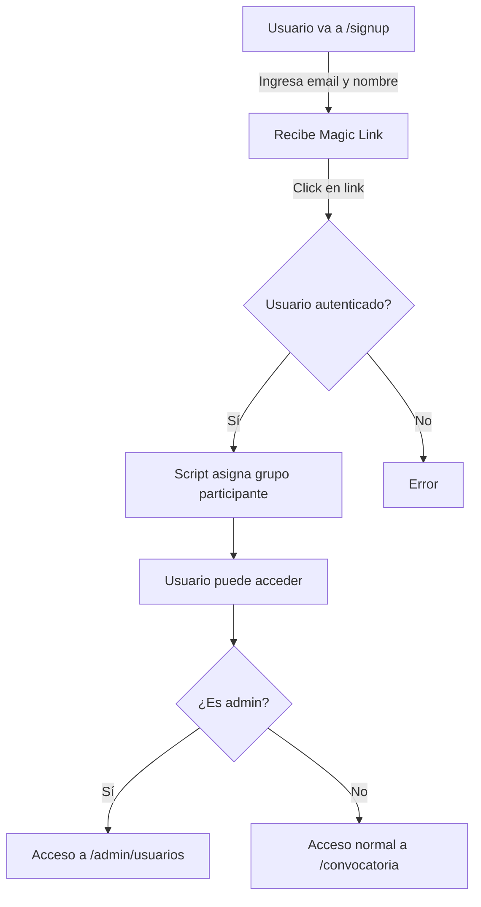

# Configuración Final: Auto-asignar Grupo Participante

## ✅ Implementado

Todos los usuarios que se registren con magic link **automáticamente serán asignados al grupo 'participante'**.

### Flujo de Registro

```
1. Usuario ingresa nombre y email
2. Recibe magic link por correo
3. Hace clic en el link (se autentica)
4. Automáticamente se asigna al grupo 'participante'
5. Puede comenzar a participar
```

### Cambios Realizados

#### 1. **Signup Page** (`src/routes/signup/+page.svelte`)
```typescript
// Ahora:
// 1. Envía magic link con full_name en metadata
// 2. Llama a addUserToGroup() para asignar grupo 'participante'

await addUserToGroup(user.id, 'participante');
```

#### 2. **API Endpoint** (Opcional)
```
POST /api/auth/assign-participant-group
```
- Verifica que el usuario esté autenticado
- Obtiene el grupo 'participante'
- Inserta la relación usuario-grupo

#### 3. **GroupsService** (`src/lib/services/groupsService.ts`)
- Función `addUserToGroup()` maneja la lógica de asignación
- Función `removeUserFromGroup()` para remover si es necesario

---

## 🎯 Comportamiento Actual

### Para Nuevos Usuarios
```
Signup → Magic Link → Auth → ✅ Grupo 'participante' asignado automáticamente
```

### Para Admins
El grupo 'admin' se asigna manualmente:
1. En Supabase Console (SQL)
2. O a través del panel `/admin/usuarios`

---

## 🔄 Flujo Completo de Autenticación



---

## 📋 Verificación

### Verificar que un usuario está en el grupo participante

**Opción 1: Desde Supabase Console**
```sql
SELECT * FROM user_groups_view WHERE email = 'usuario@example.com';
```

Debería mostrar: `groups: 'participante'`

**Opción 2: Desde la App**
```typescript
import { getCurrentUser } from '$lib/services/groupsService';

const user = await getCurrentUser();
console.log(user.groups); // ['participante']
console.log(user.isAdmin); // false
```

---

## 🛡️ Protección de Rutas

Si quieres proteger rutas admin, crea `src/routes/admin/+layout.ts`:

```typescript
import { redirect } from '@sveltejs/kit';
import { isAdmin } from '$lib/services/groupsService';

export async function load({ data }) {
  const { user } = await data.auth;
  
  if (!user) {
    redirect(303, '/login');
  }
  
  const userIsAdmin = await isAdmin(user.id);
  if (!userIsAdmin) {
    redirect(303, '/');
  }
  
  return { user };
}
```

---

## ⚙️ Configuración Requerida

### 1. Script SQL Ejecutado ✅
```
docs/SETUP_GROUPS_SIMPLE.sql
```

### 2. Variables de Entorno
Asegúrate de que en tu `.env.local`:
```
VITE_SUPABASE_URL=tu_url
VITE_SUPABASE_ANON_KEY=tu_anon_key
```

### 3. Primer Admin
Ejecuta manualmente (una sola vez):
```sql
INSERT INTO user_groups (user_id, group_id)
VALUES (
  'TU_USER_ID',
  (SELECT id FROM groups WHERE name = 'admin')
);
```

---

## 📊 Panel Admin

Navega a `/admin/usuarios` para:
- Ver todos los usuarios
- Ver cuáles están en grupo 'participante'
- Agregar/remover del grupo participante

Solo accesible si el usuario es admin.

---

## 🚀 Testing Local

### 1. Ejecuta el dev server
```bash
npm run dev
```

### 2. Ve a `/signup`
- Ingresa tu email y nombre
- Recibirás magic link en email (o consola si estás en dev)

### 3. Verifica en Supabase
```sql
SELECT * FROM user_groups_view;
```

---

## ⚠️ Notas Importantes

1. **Magic Link por Email**: Supabase enviará el email. En desarrollo, revisa la consola o usa Supabase testing.

2. **Redirect URL**: Actualmente redirige a `/registro`. Asegúrate de que esa ruta existe o cambio:
   ```typescript
   // En +page.svelte
   redirectUrl = `${window.location.origin}/` // O la ruta que prefieras
   ```

3. **Metadata de Usuario**: El `full_name` se guarda en `auth.users.user_metadata`. Luego puedes acceder con:
   ```typescript
   user.user_metadata?.full_name
   ```

4. **Manejo de Errores**: Si falla la asignación de grupo, el signup continúa. El admin puede asignarlo manualmente desde el panel.

---

## 📝 Próximos Pasos Opcionales

1. **Email Personalizado**: Configurar templates de email en Supabase
2. **Welcome Page**: Crear página de bienvenida después de hacer clic en magic link
3. **Profile Completado**: Requerir datos adicionales al primer login
4. **Auditoría**: Registrar cambios de grupo en `group_audit_log`

---

## ✅ Checklist Final

- [x] Script SQL ejecutado (`groups` y `user_groups` creadas)
- [x] Signup actualizado (auto-asigna grupo)
- [x] Servicio de grupos funcional
- [x] Panel admin implementado
- [ ] Primer usuario asignado como admin
- [ ] Testeado en desarrollo
- [ ] Verificado en producción
